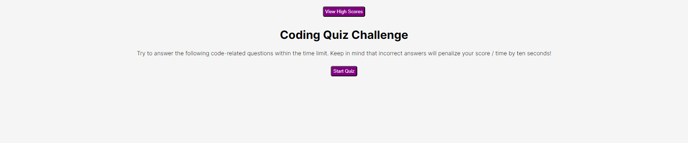

# Code Quiz Challenge

## Description

This is a multiple choice test to assess the user's basic knowledge of developement. The quiz utilizes HTML, JavaScript, and CSS. The user is presented with a muliple choice quiz and must answer all questions within a certain amount of time. If the user answers a question correct, then they are presented with the next question. If the user answers the question wrong, ten seconds is deducted from the timer. At the end of the quiz the user enters their initials.

## Installation

N/A

## Usage

1. Click "Start Quiz"
2. Answer Multiple Choice Quiz
3. Enter your initials

## Screenshots

## Link to Deployment

https://megmathis.github.io/Code_Quiz_Challenge/

## Credits

https://www.educba.com/textcontent-in-javascript/

https://developer.mozilla.org/en-US/docs/Web/API/Element/innerHTML

https://developer.mozilla.org/en-US/docs/Web/API/Event/preventDefault

https://developer.mozilla.org/en-US/docs/Web/JavaScript/Reference/Global_Objects/JSON/parse

https://developer.mozilla.org/en-US/docs/Web/JavaScript/Reference/Global_Objects/JSON/stringify

https://developer.mozilla.org/en-US/docs/Web/API/Window/localStorage

https://developer.mozilla.org/en-US/docs/Web/JavaScript/Reference/Global_Objects/Array/from

https://css-tricks.com/almanac/selectors/a/after-and-before/

## License

Please refer to LICENSE in repo.
